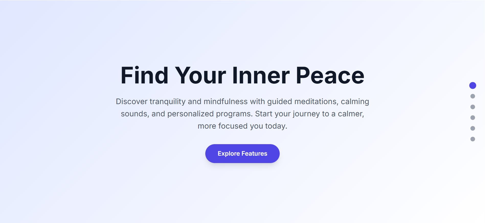
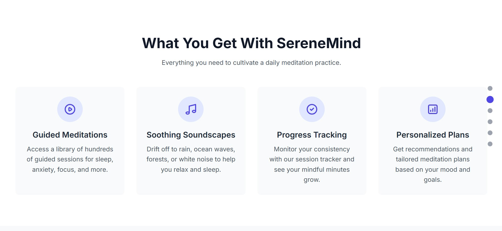
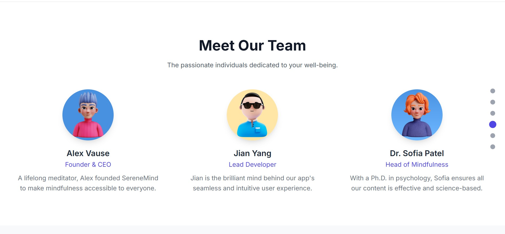
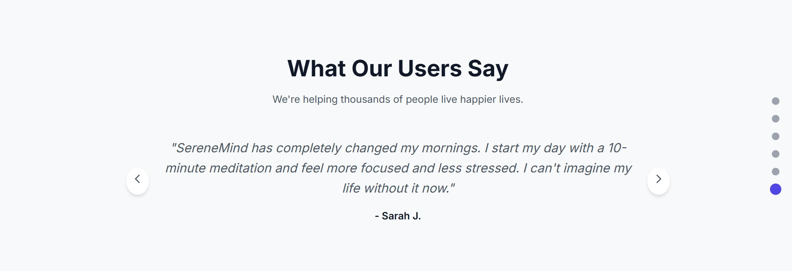

# SereneMind Meditation App

description: sereneMind is a sleek and responsive meditation web appdesigned to help users find calm,
clarity,and balance in their daily livers.built with simplicity and focus in mind,it offers guided meditation, ambient soundscap,and personalized welness plans,wether you are a beginner or an expriencienced mediator,serenMind provides a peacful digital space to relax, breathe,and reset.
visual assets used in this project were sourced from Freeppik and Dribble,withe respect to copyright and attribution. 

[Live Preview](https://meditation-bice.vercel.app/)

## Features

- Cross platform
- Light/dark mode toggle
- Live previews
- Guided Meditations
- Soothing Soundscapes
- Progress Tracking
- Personalized Plans

## ScreenShots

### MAIN

### FEATURES

### TEAM

### TESTIMONIALS

## Authors

- [@Aliben91](https://www.github.com/Aliben91)
